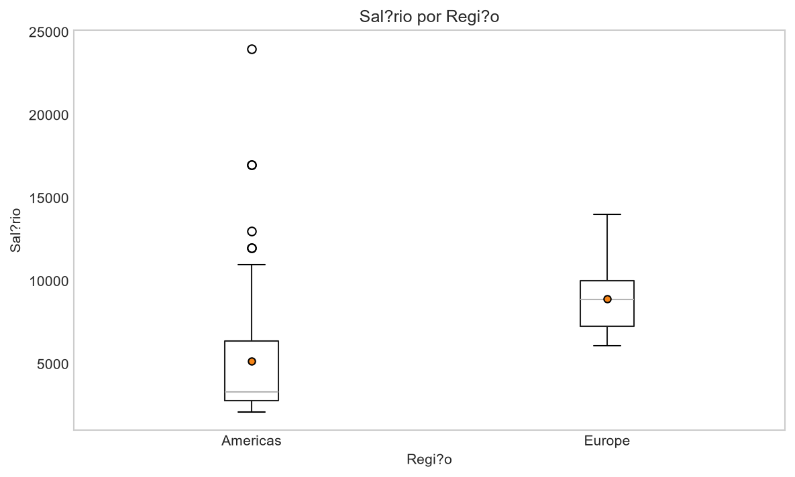
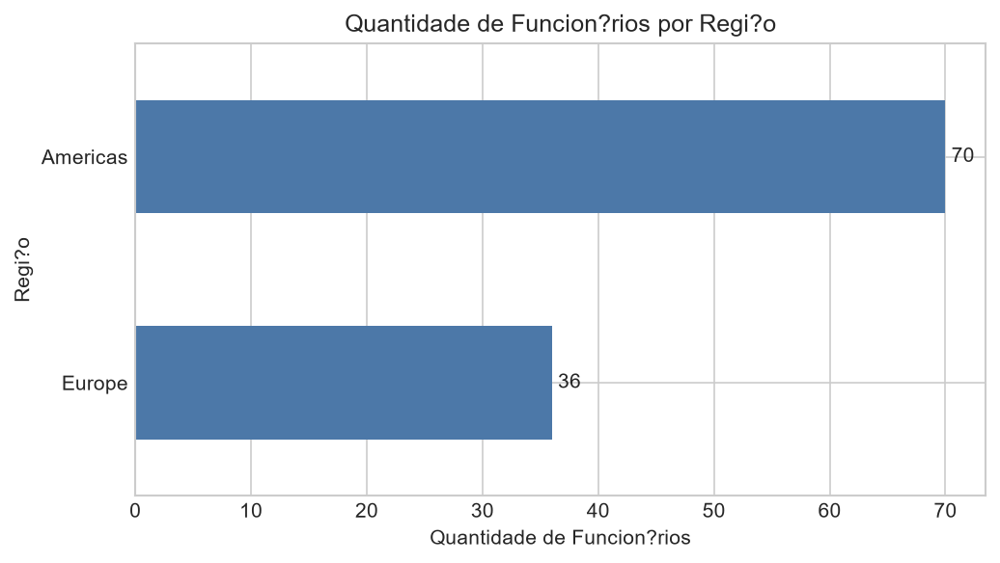
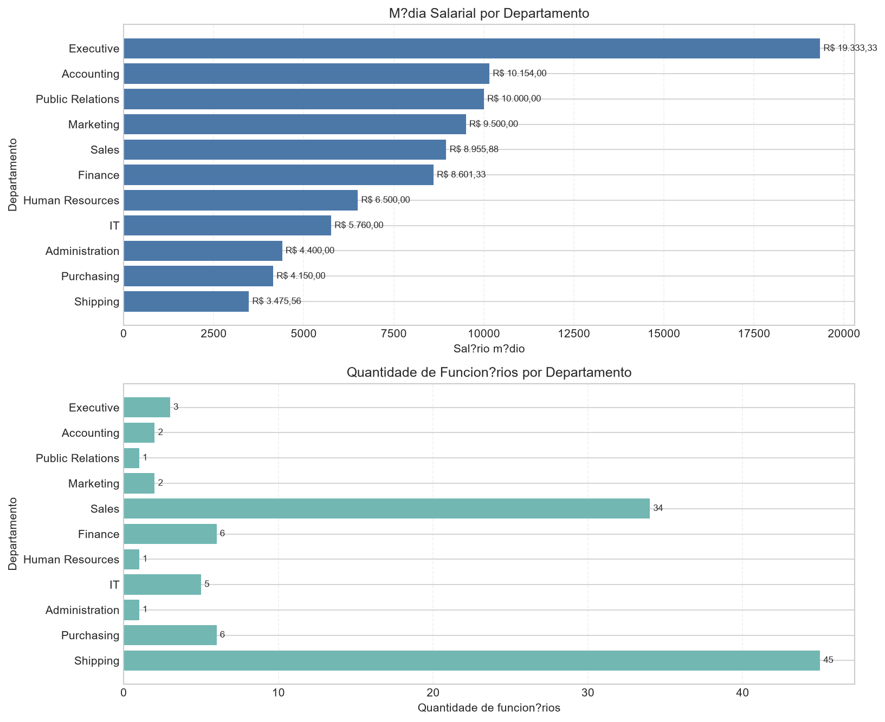
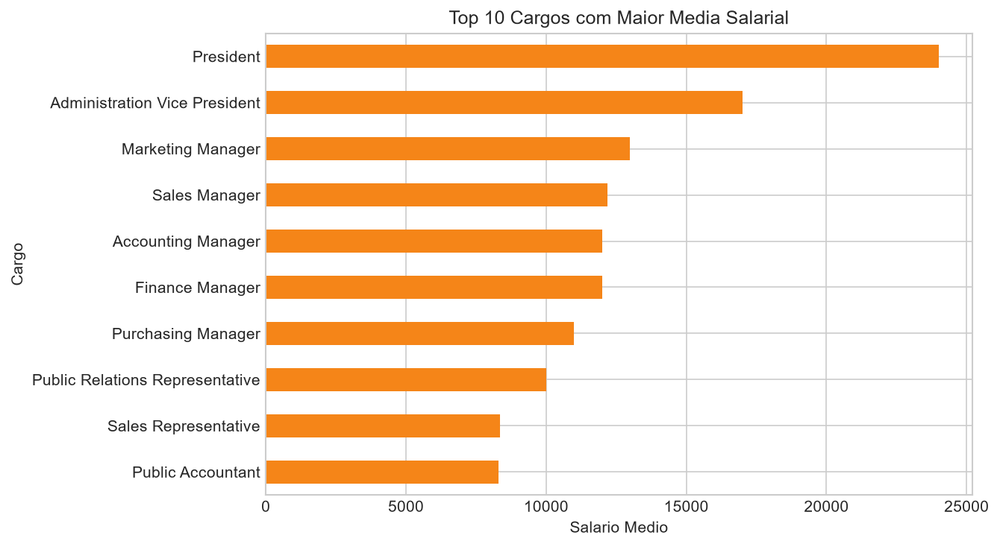

# Projeto Final EDA - Salários por Departamento e Região

Projeto simples de Análise Exploratória de Dados (EDA) com a base HR, usando duas consultas SQL no FreeSQL, exportação para CSV e análise em Python.

## Aluno e turma

- **Nome:** Evelyn Klein
- **Turma:** 2026/1 - V2

## Objetivo do trabalho

O objetivo deste projeto foi analisar a distribuição salarial dos colaboradores da base HR, comparando salários por departamento, cargo e região, além de identificar padrões, diferenças entre setores e possíveis outliers.

## Organização do projeto

- [x] Montar a Query 1
- [x] Montar a Query 2
- [x] Exportar os dados para CSV
- [x] Ler os CSVs no Python
- [x] Fazer a análise exploratória
- [x] Criar os gráficos
- [x] Escrever os resultados no README.md
- [x] Revisar o projeto final

## Tabelas usadas

- `hr.employees`: tabela principal com os funcionários e salários.
- `hr.jobs`: tabela com os cargos.
- `hr.departments`: tabela com os departamentos.
- `hr.locations`: tabela com as cidades e locais.
- `hr.countries`: tabela com os países.
- `hr.regions`: tabela com as regiões geográficas.

## Resumo das consultas SQL

### Query 1 - Salário por departamento e cargo

Consulta baseada em `employees`, com `LEFT JOIN` em `jobs` e `departments`.

Campos retornados:

- `EMPLOYEE_ID`
- `FIRST_NAME`
- `LAST_NAME`
- `SALARY`
- `JOB_TITLE`
- `DEPARTMENT_NAME`

Objetivo:

- analisar salários por cargo
- comparar salários entre departamentos
- apoiar as análises de histograma, boxplot e ranking de cargos

### Query 2 - Funcionários por região com localização

Consulta baseada em `employees`, com `LEFT JOIN` em `departments`, `locations`, `countries` e `regions`.

Campos retornados:

- `EMPLOYEE_ID`
- `FIRST_NAME`
- `LAST_NAME`
- `DEPARTMENT_NAME`
- `CITY`
- `COUNTRY_NAME`
- `REGION_NAME`

Objetivo:

- analisar a distribuição geográfica dos funcionários
- relacionar localização com os salários
- permitir a junção com a Query 1 para comparar salários por região

## Análise feita em Python

1. Os arquivos `query_01.csv` e `query_02.csv` foram lidos com `pandas`.
2. Foi feita uma exploração inicial com `head()`, `info()`, `describe()` e verificação de valores nulos.
3. Foram calculadas estatísticas básicas: média, mediana, mínimo e máximo.
4. Os salários foram agrupados por departamento, cargo e região.
5. Os dados das duas consultas foram combinados pela coluna `EMPLOYEE_ID`.
6. Foram gerados gráficos para visualizar a distribuição salarial, o boxplot por departamento e região, a média salarial por região, a quantidade de funcionários por região, a comparação entre setores e as faixas salariais.
7. Foi aplicada a regra do Intervalo Interquartil (IQR) para identificar outliers.

## Principais resultados encontrados

- Média salarial geral: **R$ 6.461,83**
- Mediana salarial geral: **R$ 6.200,00**
- Salário mínimo: **R$ 2.100,00**
- Salário máximo: **R$ 24.000,00**
- O departamento com maior média salarial foi **Executive** (**R$ 19.333,33**).
- O departamento com menor média salarial foi **Shipping** (**R$ 3.475,56**).
- A região **Europe** apresentou média salarial superior à região **Americas**.
- A maior parte dos salários está concentrada nas faixas mais baixas e intermediárias.
- Apenas um salário foi identificado como outlier, pertencente ao cargo **President** no departamento **Executive**.

## Gráficos principais

### Histograma da distribuição dos salários


### Boxplot do salário por departamento


### Boxplot do salário por região



### Média salarial por região


### Quantidade de funcionários por região



### Média salarial x quantidade de funcionários por departamento



### Distribuição dos funcionários por faixa salarial


### Top 10 cargos com maior média salarial



## Como executar o projeto

### Pré-requisitos

- Python 3 instalado
- Git instalado
- Acesso ao repositório do projeto

### Instalação

Crie e ative um ambiente virtual:

```bash
python -m venv .venv
```

No Windows:

```bash
.venv\Scripts\activate
```

Instale as dependências:

```bash
pip install -r requirements.txt
```

### Execução

Para abrir o notebook:

```bash
jupyter notebook
```

Depois, abra:

```text
notebooks/Notebook_Evelyn.ipynb
```

Se preferir executar a análise direto no Python:

```bash
python src/analise_eda.py
```

Observação: o script também possui fallback para ler os CSVs a partir do repositório remoto, caso os arquivos locais não estejam disponíveis.

## Sugestões de melhoria para futuras versões

- adicionar mais comparações por cargo e por país
- criar um dashboard interativo
- aprofundar o tratamento de outliers
- incluir análise temporal, caso a base seja ampliada
- automatizar a exportação e atualização dos gráficos

## Checklist final

- [x] Query 1 criada e documentada
- [x] Query 2 criada e documentada
- [x] CSVs gerados e organizados em `data/`
- [x] Notebook com EDA e gráficos
- [x] Script Python com a análise
- [x] README com objetivo, etapas, resultados e execução
- [x] Repositório pronto para avaliação
