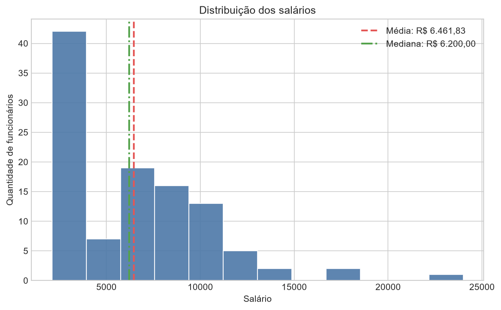
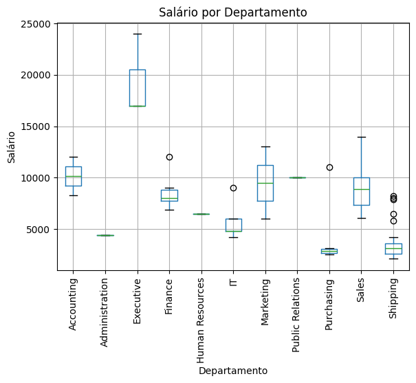
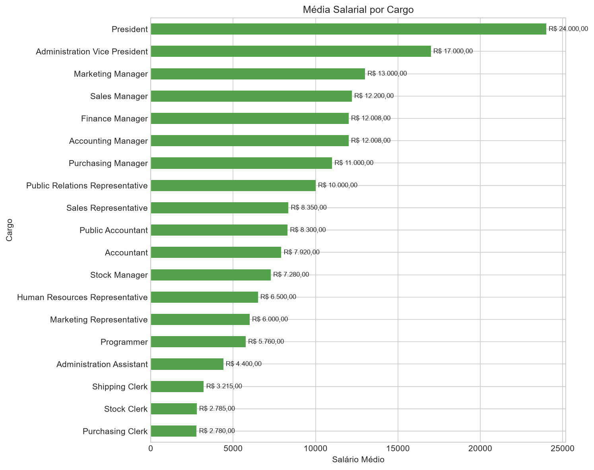
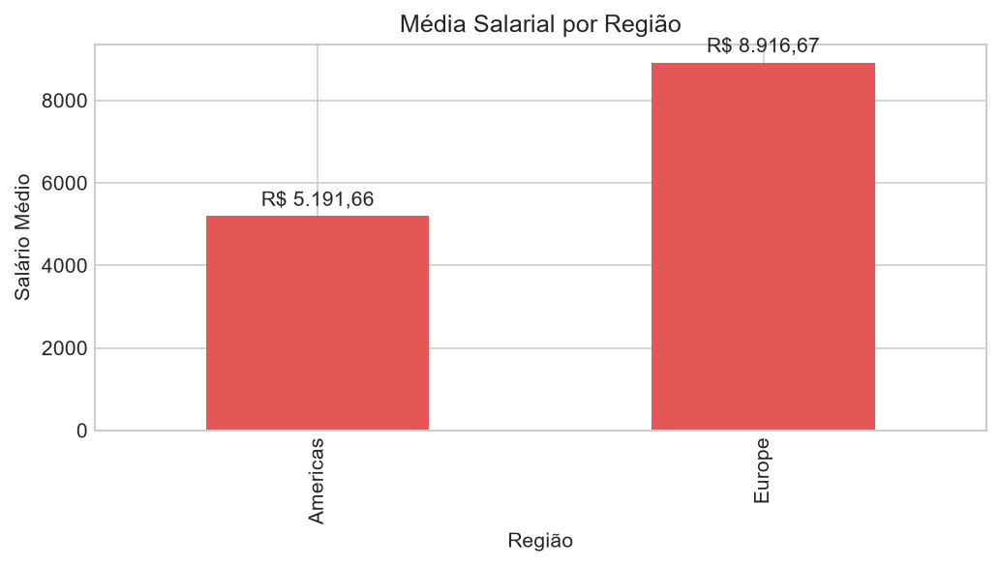
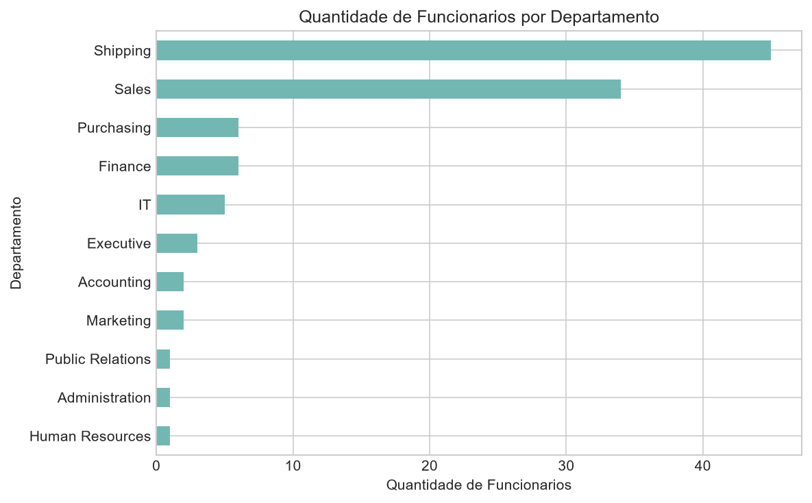
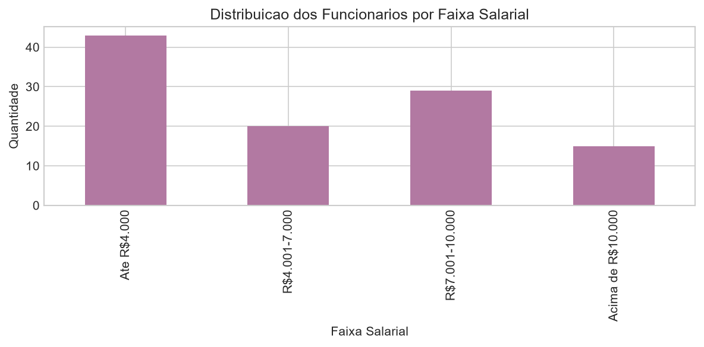

# Projeto Final EDA - Salários por Departamento e Região

Projeto final de Análise Exploratória de Dados com a base HR, usando consultas SQL exportadas em CSV e análise em Python.

## Aluno

- Nome: Evelyn Klein
- Turma: 2026/1 - V2

## Objetivo do trabalho

O objetivo deste projeto foi analisar a distribuição de salários por departamento, cargo e região, identificando padrões, comparações relevantes e possíveis outliers na base HR.

## Tabelas utilizadas

- `hr.employees`: tabela principal com os funcionários e salários.
- `hr.jobs`: tabela com os cargos.
- `hr.departments`: tabela com os departamentos.
- `hr.locations`: tabela com cidades e locais.
- `hr.countries`: tabela com os países.
- `hr.regions`: tabela com as regiões geográficas.

## Estrutura do repositório

- `data/` - arquivos CSV extraídos das consultas.
- `notebooks/` - notebook principal da análise.
- `sql/` - consultas SQL usadas na extração.
- `src/` - script Python com a EDA.
- `outputs/figures/` - gráficos gerados para a documentação.

## Resumo das consultas SQL

### Query 1 - Salário por departamento e cargo

Consulta baseada em `employees`, com `LEFT JOIN` em `jobs` e `departments`.

Campos retornados:

- `EMPLOYEE_ID`
- `FIRST_NAME`
- `LAST_NAME`
- `SALARY`
- `JOB_TITLE`
- `DEPARTMENT_NAME`

Objetivo:

- analisar salários por cargo
- comparar salários entre departamentos
- apoiar a criação do histograma e do boxplot

### Query 2 - Funcionários por região com localização

Consulta baseada em `employees`, com `LEFT JOIN` em `departments`, `locations`, `countries` e `regions`.

Campos retornados:

- `EMPLOYEE_ID`
- `FIRST_NAME`
- `LAST_NAME`
- `DEPARTMENT_NAME`
- `CITY`
- `COUNTRY_NAME`
- `REGION_NAME`

Objetivo:

- analisar a distribuição geográfica dos funcionários
- relacionar localização com os salários
- permitir a junção com a Query 1 para comparar salários por região

## Como a análise foi feita em Python

1. Os arquivos `query_01.csv` e `query_02.csv` foram lidos com `pandas`.
2. Foi feita uma exploração inicial com `head`, `info`, `describe` e verificação de valores nulos.
3. A média, mediana, valor mínimo e valor máximo dos salários foram calculados.
4. Os salários foram agrupados por departamento, cargo e região.
5. Os dados das duas consultas foram combinados pela coluna `EMPLOYEE_ID`.
6. Foram gerados gráficos para visualizar a distribuição salarial, o boxplot por departamento e as comparações por cargo e região.

## Principais resultados encontrados

- Média salarial geral: `6461.83`
- Mediana salarial geral: `6200.00`
- Salário mínimo: `2100.00`
- Salário máximo: `24000.00`
- O maior salário identificado foi o do cargo `President`.
- O departamento com maior média salarial foi `Executive` (`19333.33`).
- Em seguida aparecem `Accounting` (`10154.00`), `Marketing` (`9500.00`) e `Sales` (`8955.88`).
- A região `Europe` apresentou média salarial superior à região `Americas`.
- O boxplot indicou um outlier salarial relevante, acima da faixa esperada.
- Os departamentos com mais funcionários foram `Shipping` e `Sales`.

## Gráficos

### Histograma da distribuição dos salários



### Boxplot do salário por departamento



### Média salarial por cargo



### Média salarial por região



### Quantidade de funcionários por departamento



### Distribuição por faixa salarial



## Como executar o projeto

### Pré-requisitos

- Python 3 instalado
- Git instalado
- Acesso aos arquivos CSV do projeto

### Instalação

```bash
python -m venv .venv
```

No Windows:

```bash
.venv\Scripts\activate
```

Instale as dependências:

```bash
pip install -r requirements.txt
```

### Execução

Abra o notebook:

```bash
jupyter notebook
```

Ou abra diretamente:

```text
notebooks/Notebook_Evelyn.ipynb
```

Se preferir, também é possível executar a análise pelo script:

```bash
python src/analise_eda.py
```

## Sugestões de melhoria para futuras versões

- adicionar mais gráficos comparativos
- criar uma análise mais detalhada por faixa salarial
- incluir tratamento de outliers com mais profundidade
- construir um dashboard interativo
- conectar a extração diretamente ao banco, em vez de usar apenas CSV
- expandir a documentação com mais interpretações dos resultados

## Checklist da entrega

- [x] Consultas SQL criadas
- [x] CSVs exportados
- [x] Análise em Python realizada
- [x] Gráficos gerados
- [x] README documentado
- [x] Repositório publicado no GitHub
